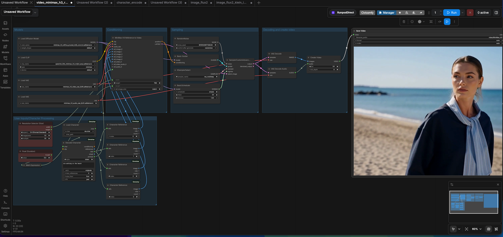

# ComfyUI Omnichar Custom Node
### One .char format for consistent portable characters

Official `.char` integration with ComfyUI. Build a character once, use it across image and
video models. Same face, cloths & body across every model. 
Currently supports: Minimax H3, Krea2, Flux2 dev, klein9B & 4B. 



A `.char` holds a character's reference images, its locked description, and often a trained LoRA.
Build one here with Encode Character, or in [Omnichar Studio](https://omnichar.org) on your own GPU
or [Omnichar Cloud](https://cloud.omnichar.org). The same file then feeds FLUX.2, MiniMax H3 and
anything else that takes references.

## Features

- **Character Files**: Open a `.char` built in Omnichar Studio or Cloud
- **Reference Images**: One batch, or one per numbered slot, both from the same resolved set
- **Positions Kept**: Reference order is preserved, because a prompt addresses images by number
- **Conditioning**: Wire a CLIP to get conditioning straight out, or take the prompt as text
- **Trained LoRA**: Applied to MODEL and CLIP when the character carries one
- **Build Characters**: Encode face, body and wardrobe references into a new `.char`, three slots each
- **Python Library**: Omnichar's standalone package for `.char` integration, no dependencies

## Requirements

- ComfyUI
- Python 3.10+
- `omnichar-sdk` (installed from `requirements.txt`)

## Installation

1. Go to your ComfyUI custom nodes directory:
   ```bash
   cd ComfyUI/custom_nodes
   ```

2. Clone this repository:
   ```bash
   git clone https://github.com/omnichar/ComfyUI-Omnichar
   cd ComfyUI-Omnichar
   ```

3. Install the reader:
   ```bash
   pip install -r requirements.txt
   ```

4. Restart ComfyUI

## Where Characters Live

Put `.char` files in `ComfyUI/models/characters/`. The loader lists whatever is there.

To share one folder with Omnichar Studio, set `INLINE_CHARACTERS_DIR` to its characters directory
and both read the same files.

## Nodes

| Node | Inputs | Outputs |
| --- | --- | --- |
| Load Character | `char`, `char_path` | `char` |
| Load Character (Upload) | browser upload | `char` |
| Decode Character | `char`, `style`, `clip`, `prompt`, `arch`, `max_references`, `size_from`, `fit` | `conditioning`, `references`, `refs`, `sheet`, `prompt` |
| Character Reference | `refs`, `index` | `image`, `role`, `count` |
| Character References Split | `refs` | `image_0` to `image_4`, `count` |
| Character Reference Latent | `conditioning`, `refs`, `vae` | `conditioning` |
| Apply Character LoRA | `model`, `clip`, `char`, `strength`, `arch`, `min_key_coverage` | `model`, `clip` |
| Encode Character | `name`, `description`, `resolution`, `face`/`body`/`cloths` (3 slots each) | `char` |
| Save Character | `char`, `filename`, `overwrite` | `path` |
| Save Character (Download) | `char`, `filename` | `filename`, browser download |

### Browser upload and download

Add **Load Character (Upload)** and click **choose file to upload**. Select a `.char`
file using your browser's file picker, just like Load Image. Once the upload finishes,
connect its `char` output to Decode Character or another character node and run.
The uploaded file is retained in ComfyUI's input folder so saved workflows can reuse it.

Connect **Encode Character** to **Save Character (Download)**, enter a filename,
and run the workflow. Then click **download character** to download the complete
`.char` file to your own computer. `.char` is added if missing. Your browser controls
the destination folder; enable its "Ask where to save each file" setting to choose
a folder on every download. Downloads are staged in ComfyUI's temporary folder;
if a download expires after cleanup/restart, run the workflow again.

This also works when ComfyUI runs on a remote server. Uploads respect ComfyUI's
configured maximum upload size. The original Load Character and Save Character
nodes continue to use registered server folders. Restart ComfyUI and refresh the
browser after updating. If you added the earlier External nodes, remove and re-add
them to refresh their widgets.

## Guide

A character is a few reference images plus a description. Encode Character sorts them by role,
so face comes first and the prompt numbers follow that order.

<table>
  <tr>
    <td align="center"></td>
    <td align="center"></td>
    <td align="center"></td>
    <td align="center"></td>
  </tr>
  <tr>
    <td align="center"><code>face</code></td>
    <td align="center"><code>body</code></td>
    <td align="center"><code>cloths</code></td>
    <td align="center"><code>cloths_2</code></td>
  </tr>
</table>

Those four go into Encode Character, which writes `sia.char`. Save Character puts it in
`ComfyUI/models/characters/`, and Load Character picks it up from there.

Decode Character turns a character into a prompt and a resolved reference list. Models
that take one batch read `references`. Models with numbered slots, like MiniMax H3, take `refs` into
a Character References Split node, or a Character Reference node per slot. Edit models that read references as latents, like FLUX.2, take
`refs` into a Character Reference Latent node on both the positive and the negative conditioning.

### Workflows

- [Build a `.char`](workflows/character_encode.json) from face, body and wardrobe references
- [FLUX.2 Klein 9B](workflows/flux_klein_9b_image_char.json), references as latents, to an image
- [MiniMax H3](workflows/minimax_h3_char_video.json), references in numbered slots, to a video

## Python Library

Omnichar's standalone package for `.char` integration. Install it anywhere, not only in ComfyUI:

```bash
pip install omnichar-sdk
```

See [packages/omnichar-sdk/README.md](packages/omnichar-sdk/README.md).

## License

`packages/omnichar-sdk/` is Apache-2.0, so closed-source tools can read `.char` files.
Everything else is GPL-3.0-or-later, because ComfyUI is.

## Links

- [Omnichar Studio](https://omnichar.org)
- [Omnichar Cloud](https://cloud.omnichar.org)
- [ComfyUI](https://github.com/comfyanonymous/ComfyUI)
- [Report an issue](https://github.com/omnichar/ComfyUI-Omnichar/issues)
